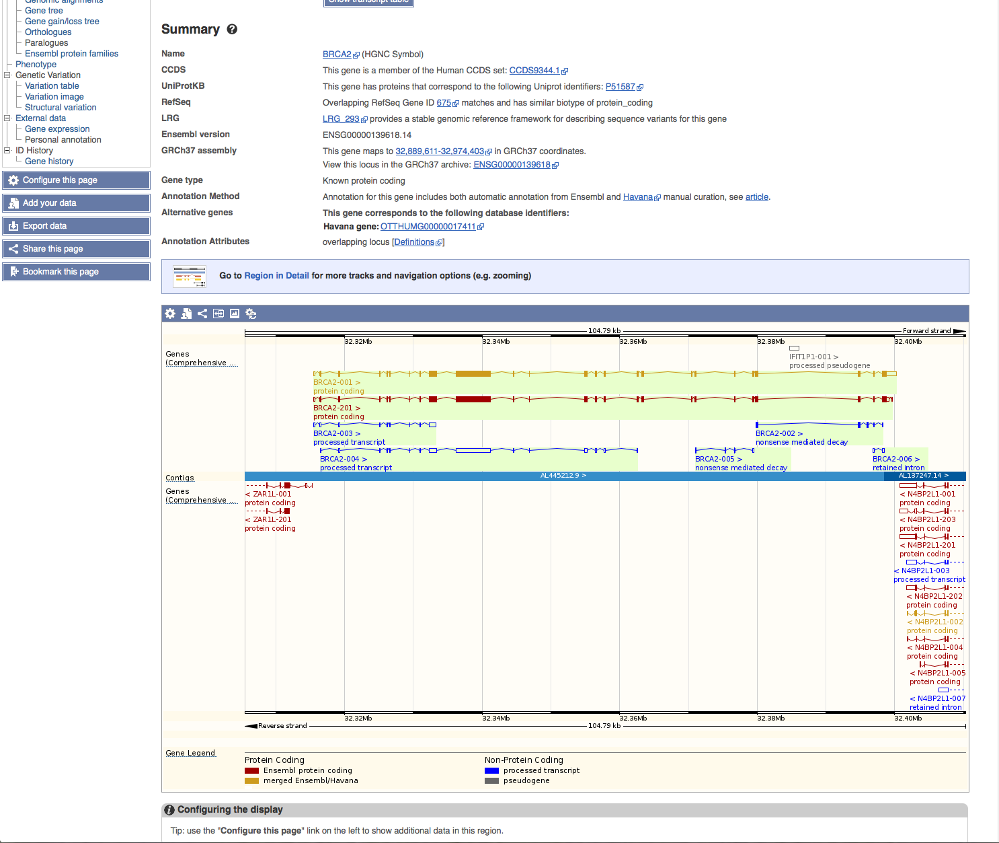
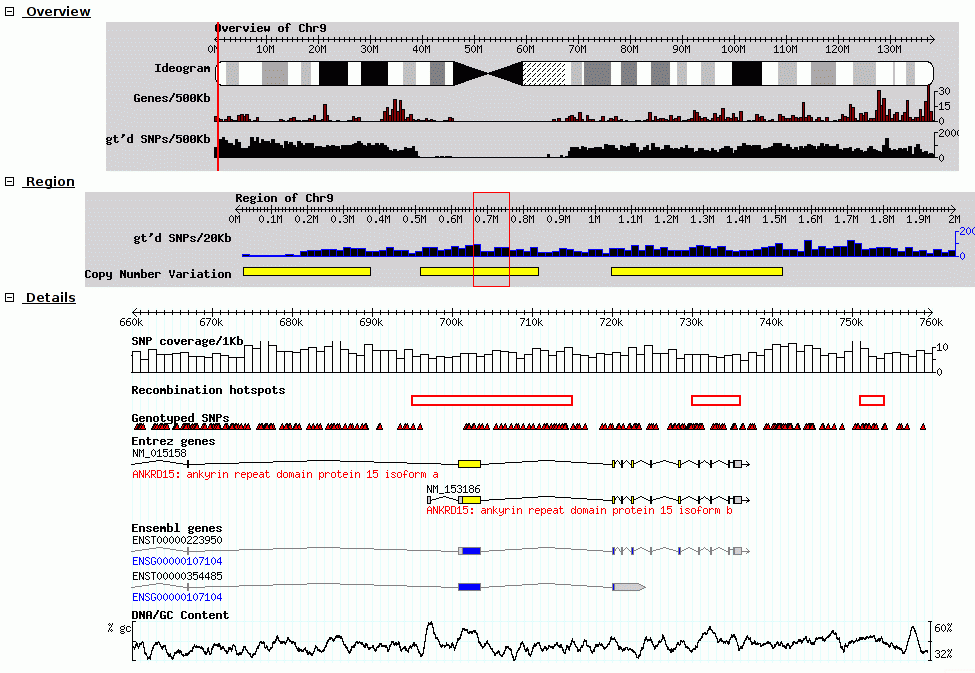
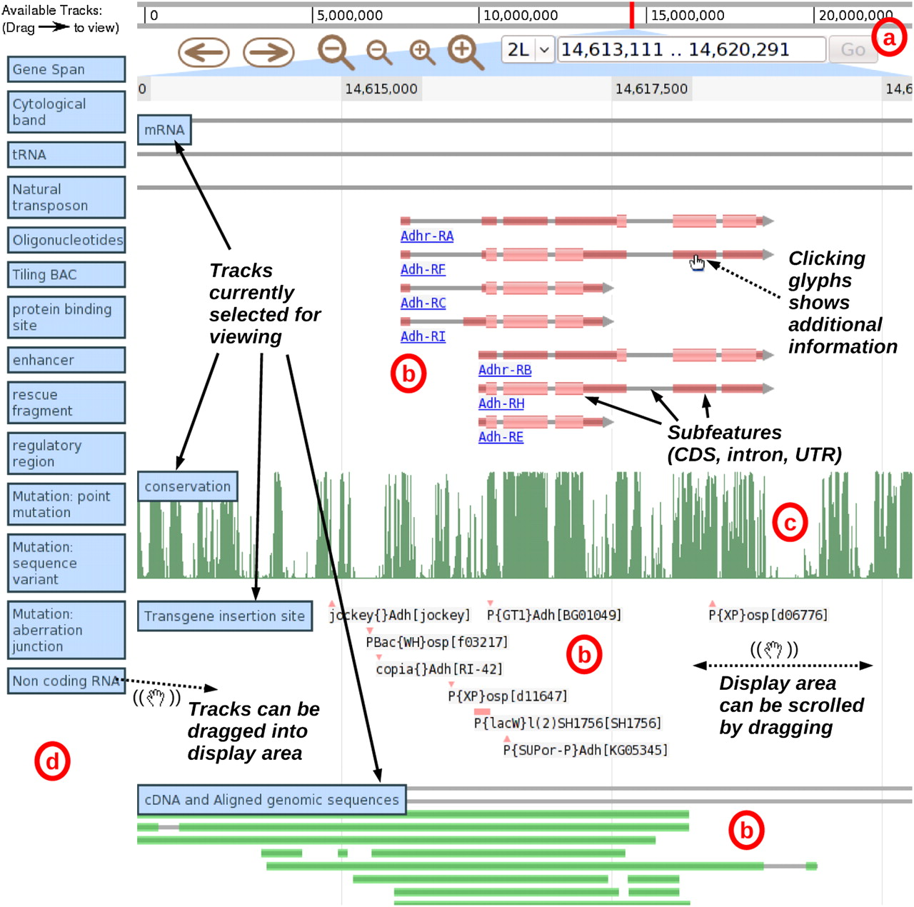
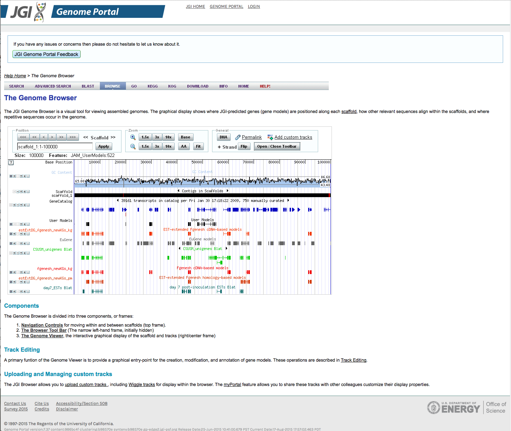
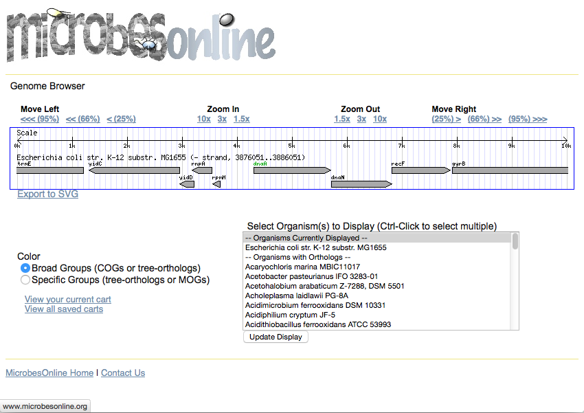
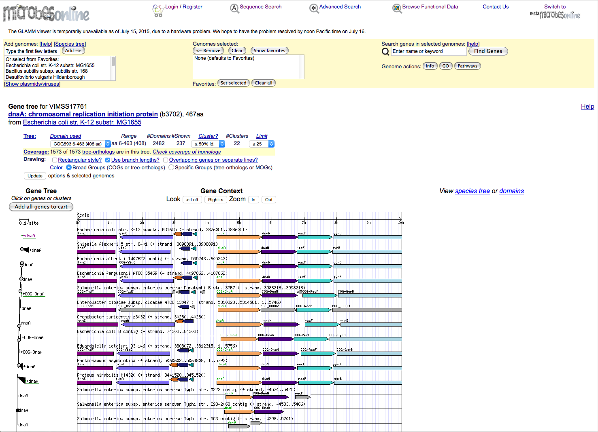
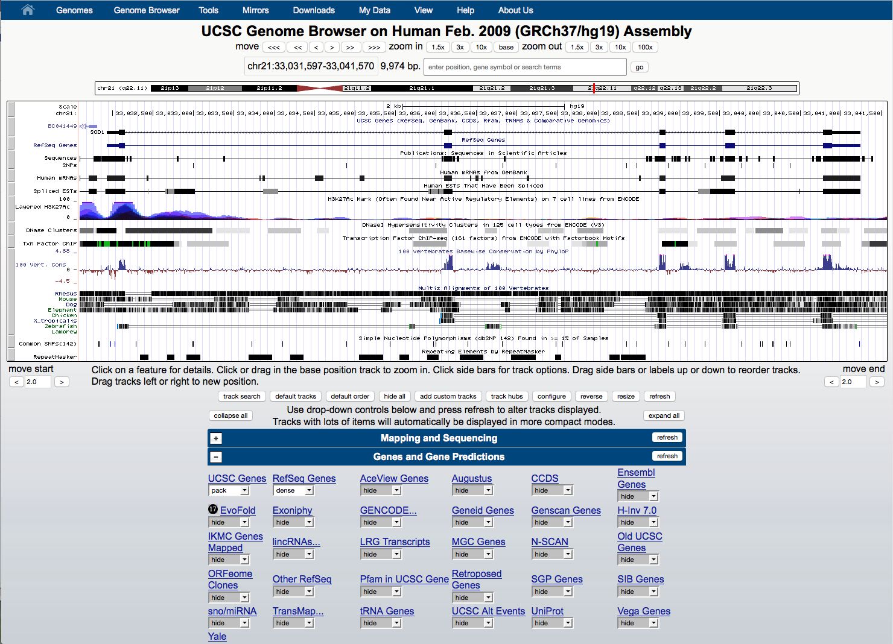
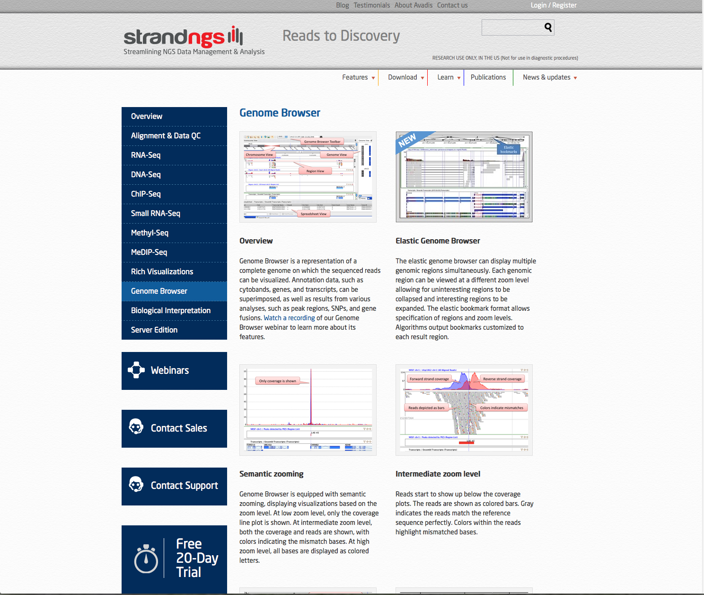

# Browsers

This page summarizes the different available open-source genome browsers.

## Circos

## Ensembl

## GBrowse

## JBrowse

## JGI

## MO

### Contig browser

### Tree browser

## Rgb

## UCSC

## strandNGS

