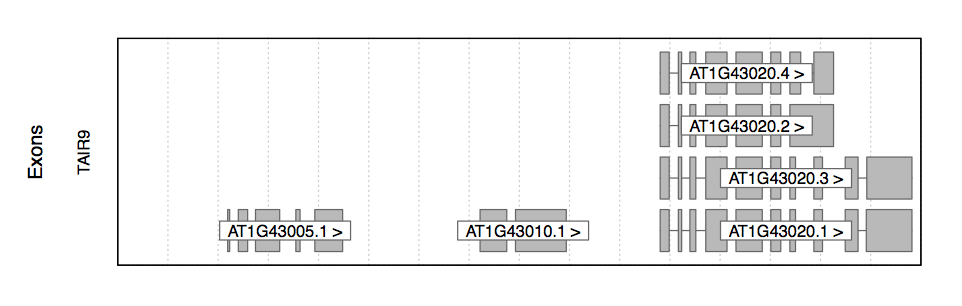

# Browsers

This page summarizes the different available open-source genome browsers.

* [Circos](#Circos)
* [ENSEMBL](#ENSEMBL)
* [GBrowse](#GBrowse)
* [JBrowse](../#JBrowse)
* [JGI](#JGI)
* [Microbes Online](#Microbes Online)
* [Rgb](#Rgb)
* [UCSC](#UCSC)
* [strandNGS](#strandNGS)

## Circos

## Ensembl

## GBrowse

## JBrowse

## JGI

## Microbes Online

### Contig browser

### Tree browser

## Rgb

## UCSC

## strandNGS

